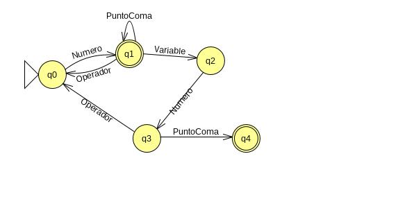

# analizador_lexico_sintactico_de_derivadas
Frontend de un compilador hecho en c++, que se encarga de procesar expresiones algebraícas y derivarlas
<h3>Archivos importantes:</h3>
<h5>Autores:
  Desarrollador: Carlos Chavez Laguna.
  Redactor: Ronald Zelada Cancino.</h5>
<ul>
 <li>automata_derivadas.jff ,este archivo contiene la representación del autómata determinista del compilador. Este archivo es editable y se abre con el programa JFlap.http://www.api-developer.com/2013/12/mini-manual-de-jflap.html </li>
 <li>derivada.l ,archivo con el código referente al analizador léxico (expresiones regulares, manejador de error léxico, etc.)</li>
 <li>derivada.y ,archivo con el código referente al analizador sintáctico (gramática, manejador de error sintáctico, manejador de archivos, etc.)</li>
 <li>informe_del_proyecto.pdf, describimos a detalle el funcionamiento de nuestro programa y la problemática a resolver. </li>
</ul>

 

